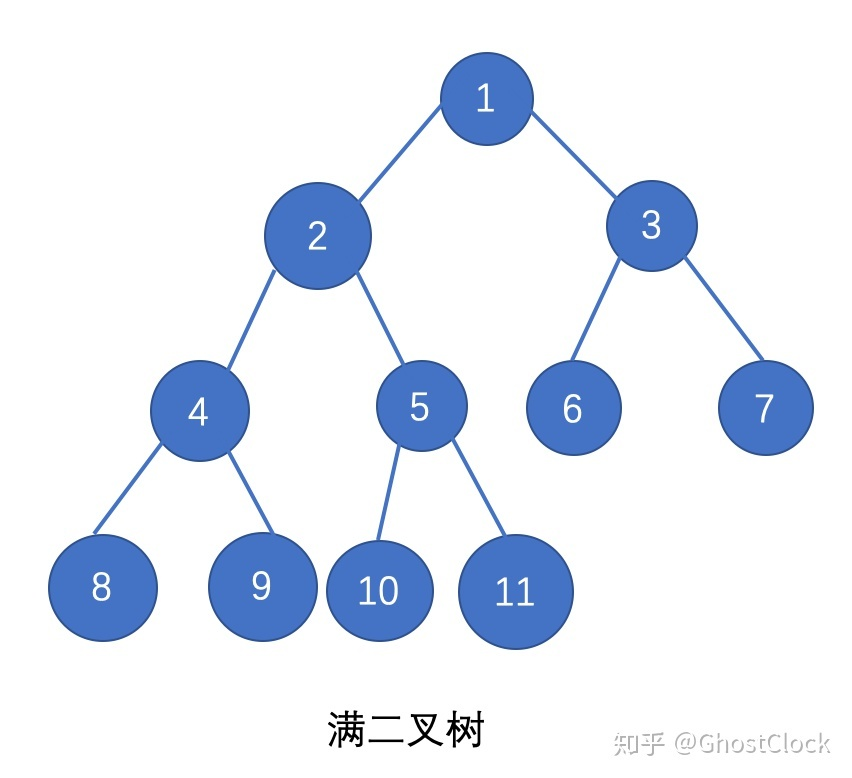
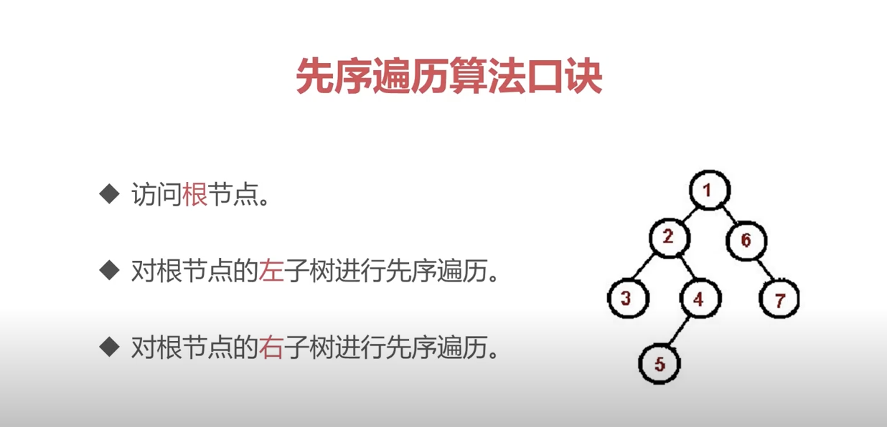
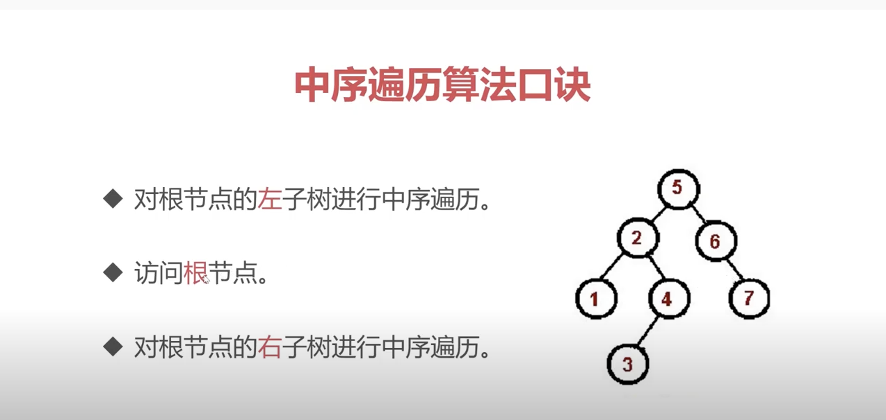
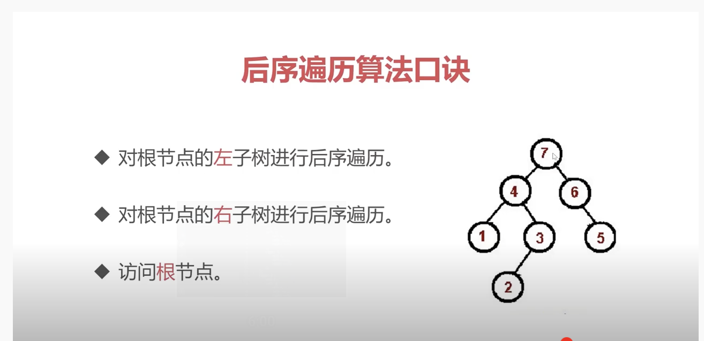
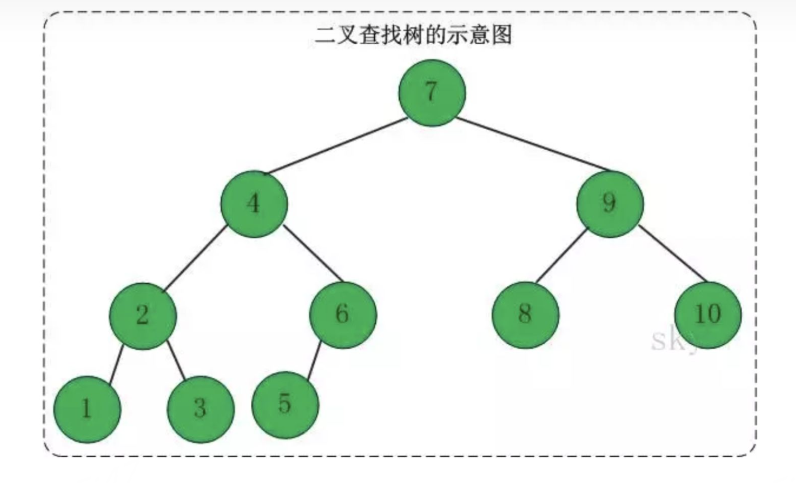

## 二叉树

- 二叉树每个节点最多有两个子节点



```js
// 二叉树结构
const binaryTree = {
  val: "a",
  left: {
    val: "b",
    left: {
      val: "c",
    },
    right: {
      val: "d",
    },
  },
  right: {
    val: "e",
    left: {
      val: "f",
    },
    right: {
      val: "g",
    },
  },
};
```

- 二叉树遍历分为 先序遍历，中序遍历，后序遍历





#### 二叉树常用的有 二叉查找树 和 红黑树

##### 二叉查找树



- 若任意节点的左子树不空，则左子树上所有结点的值均小于它的根结点的值；
- 任意节点的右子树不空，则右子树上所有结点的值均大于它的根结点的值；
- 任意节点的左、右子树也分别为二叉查找树；
- 中序遍历可以让结点有序

##### 红黑树是一种自平衡二分查找树

<a src="https://zhuanlan.zhihu.com/p/143585797">红黑树</a>
