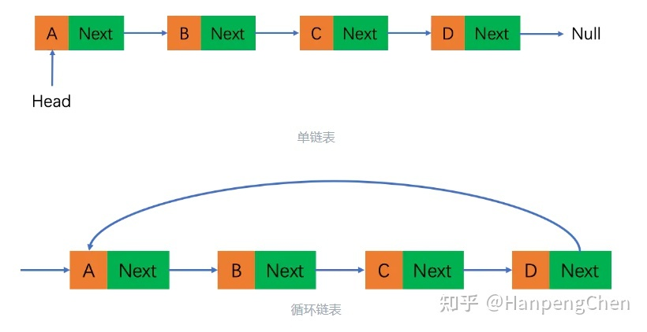
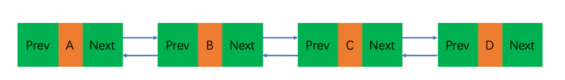

## 链表

- 链表是一种通过 next 指针把数据串联起来的数据结构

#### 链表一般分为： 单向链表、双向链表、循环链表

- 单向链表 和 循环链表
  

- 双向链表
  

#### js 中没有链表数据结构，一般是用 object 对象模拟

```js
const a = { value: "a" };
const b = { value: "b" };
const c = { value: "c" };

// 串联数据形成链表
a.next = b;
b.next = c;

// 循环链表
let p = a;
while (p) {
  console.log(p.value);
  p = p.next;
}

// 插入b2
const b2 = { value: "b2" };
b.next = b2;
b2.next = c;

// 删除b2
b.next = c;
```

#### 应用

- react 中的 fiber 结构，js 中的原型链
- 通过数组 key 获取深层数据

```js
const obj = { a: { b: { c: 1 } } };
const keys = ["a", "b", "c"];

let p = obj;
keys.forEach((key) => {
  p = p[key];
});
return p; // p = 1
```

#### leetcode 练习

<a src="https://leetcode.cn/problems/UHnkqh/">反转链表</a>

```js
/**
 * Definition for singly-linked list.
 * function ListNode(val, next) {
 *     this.val = (val===undefined ? 0 : val)
 *     this.next = (next===undefined ? null : next)
 * }
 */
/**
 * @param {ListNode} head
 * @return {ListNode}
 */
var reverseList = function (head) {
  let p1 = head;
  let p2 = null;

  while (p1) {
    const tmp = p1.next;
    p1.next = p2;
    p2 = p1;
    p1 = tmp;
  }

  return p2;
};
```
