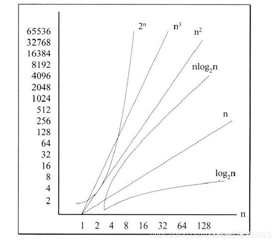

## 时间复杂度

- 定性描述程序执行时间
- 一个函数，用大 O 表示，比如 O(1), O(n), O(logN)等



#### 常见时间复杂度函数及代码

```js
O(1);

const a = 1;
```

```js
O(logN)

let i = 1;
while(i < n>) {
i *= 2;
}
```

```js
O(n);

for (let i = 0; i < n; i++) {
  console.log(i);
}
```

```js
O(n ^ 2);

for (let i = 0; i < n; i++) {
  for (let j = 0; j < n; j++) {
    console.log(i, j);
  }
}
```

## 空间复杂度

- 算法在运行过程中临时占用内存的大小
- 一个函数，用大 O 表示，比如 O(1), O(n), O(n^2)等

#### 常见空间复杂度函数及代码

```js
O(1);

// 只有一个变量
let a = 1;
a += 1;
```

```js
O(n);

// 有n个数据
const list = [];
for (let i = 0; i < n; i++) {
  list.push(i);
}
```

```js
O(n ^ 2);

// 有n^2个数据,类似于矩阵
const matrix = [];
for (let i = 0; i < n; i++) {
  matrix.push([]);
  for (let j = 0; j < n; j++) {
    matrix[i].push(j);
  }
}
```
